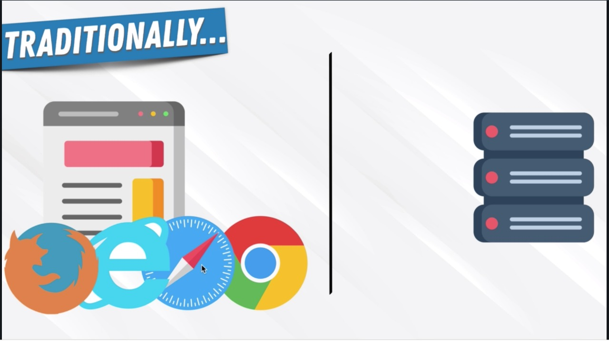
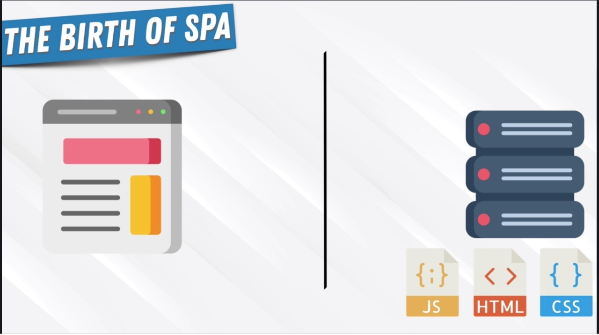

---

# Why react exsit
# What problem does it solve
# Why it makes front-end development easier
# What principles we need to understand to be more than the average react developer

---

---

---

---

---

---

@snap[west span-40 -center]

### Birth OF SPA
### It became easier and easier to work with dom then it gave birth to SPA
@snapend

@snap[north-east span-40 text-center]

@snapend
