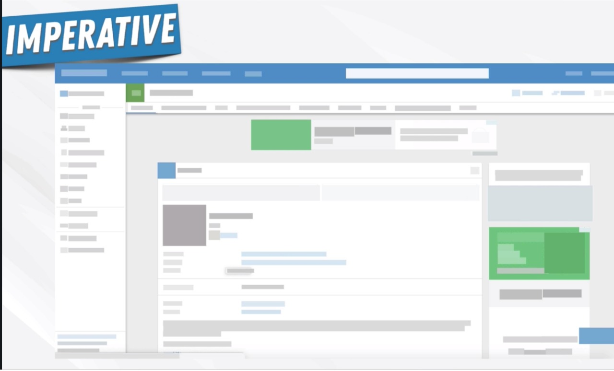

---

1. Why react exsit
2. What problem does it solve
3. Why it makes front-end development easier
4. What principles we need to understand to be more than the average react developer

---

---

---

---

---

---

##Birth OF SPA

---

##Birth OF SPA

---

##Birth OF SPA

---

##Angular Released in 2010

---

##Angular Release -  Powerful

---

##MVP - Pattern

---

##What if you have so many interactions in the app?

---

##Data flow became the problem

---

##React introduced

---
##React introduced

---
1. Airbnb
2. Uber
3. Netflix
4. twitter
5. Reddit 
6. Pinterest
7. Wix
8. Paypal
9. Stripe
10. Tumblr
11. Walmart and Now
----

And now

---

12. TheWeatherNetwork.com

---
##React Concepts

---
##React Concepts

---

##Imperative Design

---

##Dom Manipulation based on events

---

##Dom Manipulation using Javascript API

---

##Imperative Design pattern

---

##Imperative Design pattern

---

##Imperative Design pattern

---

##Declarative Design pattern

---

##Declarative Design pattern

---

##Build websites in Lego blocks - Components

---

##Build websites in Lego blocks - Components

---

##Components - Example

---

##Components are plan Javascript functions

---

##Components are created from data and receipt

---

##Components are created from data and receipt

---

##Components are independant and pluggable

---

##Rect Concepts

---
##Virtual Dom

---
##Virtual Dom In Action

---
##Virtual Dom In Action

---
##One Way Data Flow

---

##React final concept

---

##Remember Angular - How it give you everything, like framework, very opinionated

---
##React - Learn once and write everywhere

---
##React - Learn once and write everywhere

---
##React - As a cross platform

---
##React - Keywords
